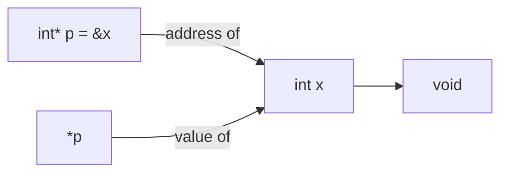

```cpp
int x;
int* p;
x = x + 5;
x = *p + 5;
*p = *p + 5;
/* all the same */

cout<<&*p<<endl; // & and * cancels out
/* cout address stored at p, so... 0x424242 */
```



### nums[ i ][ j ] is equivalent to \*(\*(nums + i) + j)

```cpp
int nums[2][3]  =  { {16, 18, 20}, {25, 26, 27} };
```

| pointer notation     | array notation | value |
| -------------------- | -------------- | ----- |
| \*(\*nums)           | nums[0][0]     | 16    |
| \*(\*nums+1)         | nums[0][1]     | 18    |
| \*(\*nums+2)         | nums[0][2]     | 20    |
| \*(\*(nums + 1))     | nums[1][0]     | 25    |
| \*(\*(nums + 1) + 1) | nums[1][1]     | 26    |
| \*(\*(nums + 1) + 2) | nums[1][2]     | 27    |
